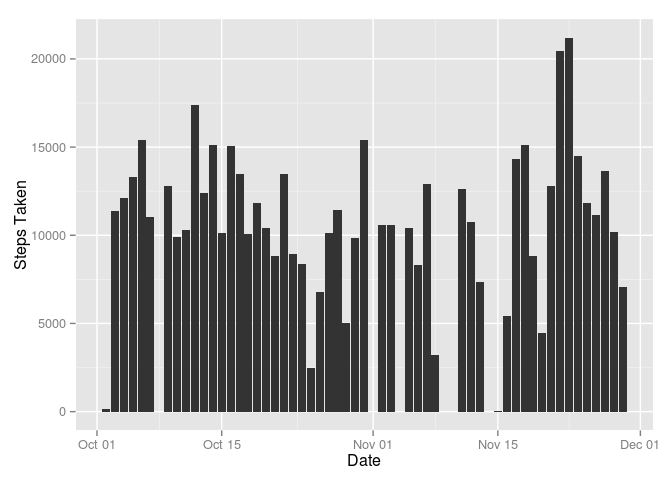
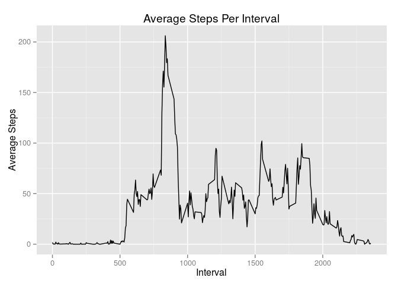
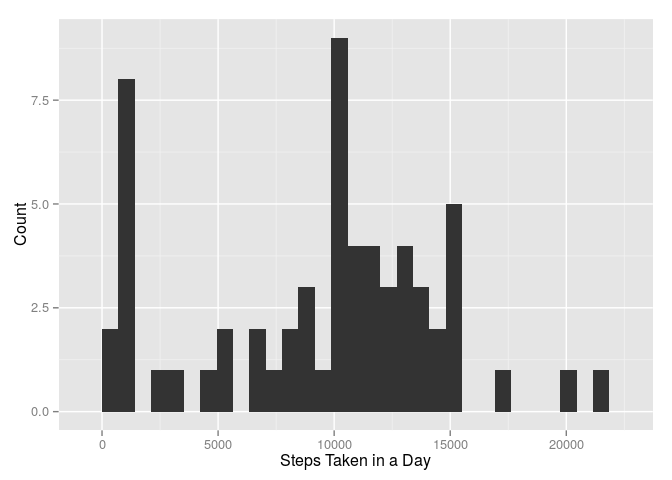
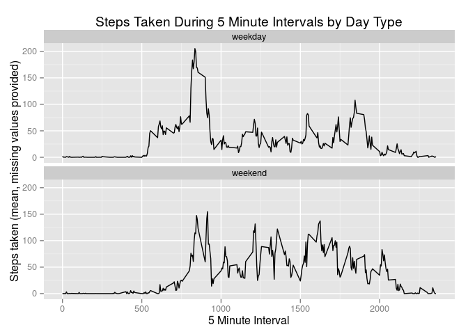

# Reproducible Research: Peer Assessment 1
Jeffrey Hohenstein  
January 12, 2015  

## Loading and preprocessing the data

### Load required libraries


```r
library(ggplot2)
library(dplyr)
```

```
## 
## Attaching package: 'dplyr'
## 
## The following object is masked from 'package:stats':
## 
##     filter
## 
## The following objects are masked from 'package:base':
## 
##     intersect, setdiff, setequal, union
```

```r
library(lubridate)
```

### Load the data and convert the data types


```r
# Load the data 
data <- read.csv("data/activity.csv", sep=",", header=TRUE, na.strings="NA")

# Convert dates to strings
data$date <- as.Date(data$date,"%Y-%m-%d")

# Create a data set containing only complete samples
completeData <- data[complete.cases(data),]
```

## What is mean total number of steps taken per day?

1. Make a histogram of the total number of steps taken each day


```r
# Group the data by day
sumData <- tbl_df(completeData)
sumData <- sumData %>%
  group_by(date) %>%
  summarise(steps=sum(steps))

# Make a line plot
ggplot(sumData,aes(x=steps)) + geom_histogram()
```

```
## stat_bin: binwidth defaulted to range/30. Use 'binwidth = x' to adjust this.
```

 

2. Calculate and report the mean and median total number of steps taken per day


```r
print( sumData %>%
  summarise(meanSteps=mean(steps),medianSteps=median(steps)) %>%
  select(meanSteps, medianSteps) 
  )
```

```
## Source: local data frame [1 x 2]
## 
##   meanSteps medianSteps
## 1  10766.19       10765
```

## What is the average daily activity pattern?

1. Make a time series plot (i.e. type = "l") of the 5-minute interval (x-axis) and the average number of steps taken, averaged across all days (y-axis)


```r
# Compute the average number of steps taken across all days within a given interval, excluding NAs
sumData <- tbl_df(completeData)
result <- sumData %>%
  group_by(date,interval) %>%
  summarise(dateIntervalSteps=sum(steps)) %>%
  group_by(interval) %>%
  summarise(averageIntervalSteps=mean(dateIntervalSteps))

# Plot the series
ggplot(
  result,
  aes(x=interval,y=averageIntervalSteps)
  ) + 
  geom_line() + 
  labs(title="Average Steps Per Interval", x= "Interval", y="Average Steps")
```

 

2. Which 5-minute interval, on average across all the days in the dataset, contains the maximum number of steps?


```r
print(
  result %>%
    filter(averageIntervalSteps == max(averageIntervalSteps))
  )
```

```
## Source: local data frame [1 x 2]
## 
##   interval averageIntervalSteps
## 1      835             206.1698
```

## Imputing missing values

1. Calculate and report the total number of missing values in the dataset (i.e. the total number of rows with NAs)


```r
print(sum(!complete.cases(data)))
```

```
## [1] 2304
```

2. Devise a strategy for filling in all of the missing values in the dataset. The strategy does not need to be sophisticated. For example, you could use the mean/median for that day, or the mean for that 5-minute interval, etc.

Given that the number of steps varies more by the time of day than by the day in which it was measured, I will use the median of the interval.


```r
sumData <- tbl_df(completeData)
medianIntervalData <- sumData %>%
  group_by(interval) %>%
  summarise(medianIntervalSteps = median(steps), meanIntervalSteps=mean(steps)) %>%
  select(interval,medianIntervalSteps,meanIntervalSteps)
```

3. Create a new dataset that is equal to the original dataset but with the missing data filled in.


```r
# Join the filledData 
filledData <- inner_join(data,medianIntervalData) 
```

```
## Joining by: "interval"
```

```r
# Fill the steps column with the median value for missing cases (thanks to limitations in dplyr)
filledData$computedSteps[!complete.cases(data)] <- filledData$medianIntervalSteps[!complete.cases(data)]
filledData$computedSteps[complete.cases(data)] <- filledData$steps[complete.cases(data)]
```

4. Make a histogram of the total number of steps taken each day and Calculate and report the mean and median total number of steps taken per day. Do these values differ from the estimates from the first part of the assignment? What is the impact of imputing missing data on the estimates of the total daily number of steps?

a. Histogram of the total number of steps taken each day


```r
histData <- tbl_df(filledData)
histData <- histData %>%
  group_by(date) %>%
  summarise(totalSteps = sum(computedSteps))

ggplot(histData,  aes(x=totalSteps) ) + geom_histogram() + labs(y="Observed or Computed Steps Taken",x="Date")
```

```
## stat_bin: binwidth defaulted to range/30. Use 'binwidth = x' to adjust this.
```

 

b. Compute the mean and median of the "filled" data set


```r
print( filledData %>%
  group_by(date) %>%
  summarise(computedSteps=sum(computedSteps)) %>%
  summarise(meanSteps=mean(computedSteps),medianSteps=median(computedSteps)) %>%
  select(meanSteps, medianSteps) 
  )
```

```
## Source: local data frame [1 x 2]
## 
##   meanSteps medianSteps
## 1  9503.869       10395
```

As one can see from the data above, filling in the missing values using the median for each interval across all days in the data set dropped both the median and mean values reported (see above). This is easily explained by the fact that the median values are often much lower than the mean values due to the fact that the number of steps is highly skewed.

## Are there differences in activity patterns between weekdays and weekends?

1. Create a new factor variable in the dataset with two levels -- "weekday" and "weekend" indicating whether a given date is a weekday or weekend day.


```r
filledData$dayType <- factor(ifelse(wday(filledData$date) %in% c(2,3,4,5,6),"weekday","weekend"))
```

2. Make a panel plot containing a time series plot (i.e. type = "l") of the 5-minute interval (x-axis) and the average number of steps taken, averaged across all weekday days or weekend days (y-axis).


```r
dayTypeData <- filledData %>%
  group_by(interval,dayType) %>%
  summarise(meanDayTypeSteps = mean(computedSteps))

ggplot(dayTypeData,aes(x=interval,y=meanDayTypeSteps)) +
  geom_line(stat="identity") +
  facet_wrap(~dayType,nrow=2) +
  labs(title="Steps Taken During 5 Minute Intervals by Day Type", x="5 Minute Interval", y="Steps taken (mean, missing values provided)")
```

 
