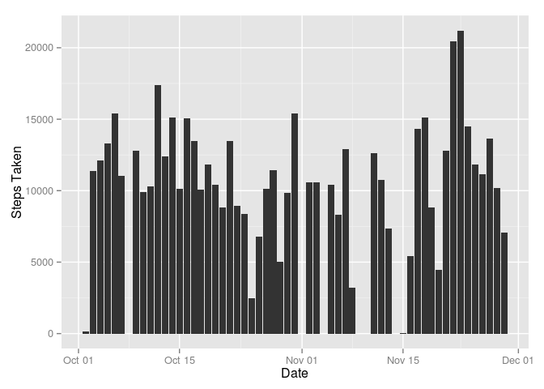

# Reproducible Research: Peer Assessment 1
Jeffrey Hohenstein  
January 12, 2015  

## Load required libraries


```r
library(ggplot2)
library(dplyr)
```

```
## 
## Attaching package: 'dplyr'
## 
## The following object is masked from 'package:stats':
## 
##     filter
## 
## The following objects are masked from 'package:base':
## 
##     intersect, setdiff, setequal, union
```

## Loading and preprocessing the data


```r
# Load the data and convert dates from strings
data <- read.csv("data/activity.csv", sep=",", header=TRUE, na.strings="NA")
data$date <- as.Date(data$date,"%Y-%m-%d")

# Create a data set containing only complete samples
completeData <- data[complete.cases(data),]
```

## What is mean total number of steps taken per day?

1. Make a histogram of the total number of steps taken each day


```r
# Group the data by day
sumData <- tbl_df(completeData)
sumData <- sumData %>%
  group_by(date) %>%
  summarise(steps=sum(steps))

# Make a line plot
ggplot(sumData,aes(x=date,y=steps)) + geom_bar(stat="identity")
```

 

2. Calculate and report the mean and median total number of steps taken per day

Compute the mean and median steps taken per day.


```r
print( sumData %>%
  summarise(meanSteps=mean(steps),medianSteps=median(steps)) %>%
  select(meanSteps, medianSteps) 
  )
```

```
## Source: local data frame [1 x 2]
## 
##   meanSteps medianSteps
## 1  10766.19       10765
```

## What is the average daily activity pattern?

1. Make a time series plot (i.e. type = "l") of the 5-minute interval (x-axis) and the average number of steps taken, averaged across all days (y-axis)


```r
# Compute the average number of steps taken across all days within a given interval, excluding NAs
sumData <- tbl_df(completeData)
result <- sumData %>%
  group_by(date,interval) %>%
  summarise(dateIntervalSteps=sum(steps)) %>%
  group_by(interval) %>%
  summarise(averageIntervalSteps=mean(dateIntervalSteps))

# Plot the series
ggplot(
  result,
  aes(x=interval,y=averageIntervalSteps)
  ) + 
  geom_line() + 
  labs(title="Average Steps Per Interval", x= "Interval", y="Average Steps")
```

 

2. Which 5-minute interval, on average across all the days in the dataset, contains the maximum number of steps?


```r
print(
  result %>%
    filter(averageIntervalSteps == max(averageIntervalSteps))
  )
```

```
## Source: local data frame [1 x 2]
## 
##   interval averageIntervalSteps
## 1      835             206.1698
```

## Imputing missing values

Note that there are a number of days/intervals where there are missing values (coded as NA). The presence of missing days may introduce bias into some calculations or summaries of the data.

1. Calculate and report the total number of missing values in the dataset (i.e. the total number of rows with NAs)


```r
print(sum(!complete.cases(data)))
```

```
## [1] 2304
```

2. Devise a strategy for filling in all of the missing values in the dataset. The strategy does not need to be sophisticated. For example, you could use the mean/median for that day, or the mean for that 5-minute interval, etc.

TODO from here on.

3. Create a new dataset that is equal to the original dataset but with the missing data filled in.

4. Make a histogram of the total number of steps taken each day and Calculate and report the mean and median total number of steps taken per day. Do these values differ from the estimates from the first part of the assignment? What is the impact of imputing missing data on the estimates of the total daily number of steps?
